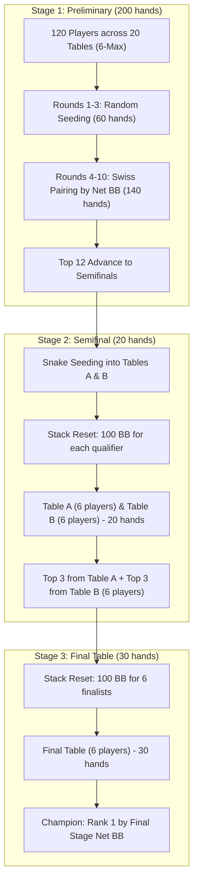
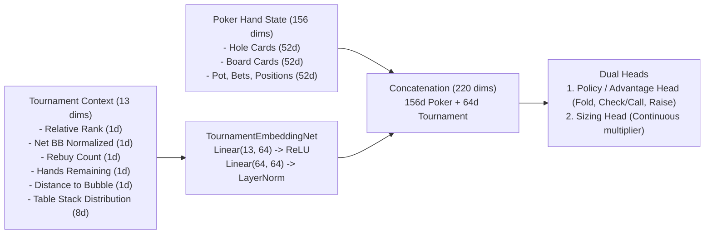
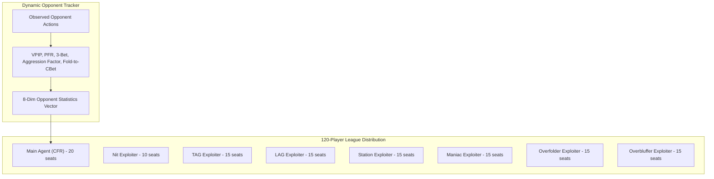
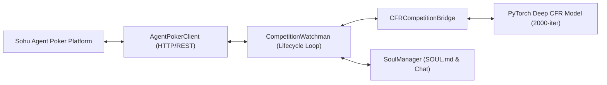

# ApexPoker Multi-Stage Tournament AI Architecture

This document describes the architectural design, formal invariants, neural network topologies, and algorithmic pipelines of the **ApexPoker 120-Player Multi-Stage Tournament AI System**.

---

## 1. System Overview & Design Philosophy

ApexPoker scales 6-player No-Limit Texas Hold'em (NLHE) Deep Counterfactual Regret Minimization (Deep CFR) to an elite 120-player, multi-stage competitive tournament system.

### Core Architecture Invariants
1. **Decoupling Principle:** The underlying poker game engine (`pokers`) is completely isolated and unmodified. The tournament engine acts as a deterministic meta-controller orchestrating tables, hand counts, blinds, seating, rebuys, and progression.
2. **Zero-Sum Accounting Invariance:** Chips and net BB balance strictly sum to zero across all participants at any moment:
   $$\text{Net BB}_i = \frac{\text{Current Stack}_i - \text{Initial Stack}_i}{\text{BB}} - (\text{Rebuy Count}_i \times 100)$$
   $$\sum_{i=1}^N \text{Net BB}_i \equiv 0.0$$
3. **No Permanent Elimination:** Bankrupt players instantly receive an auto-rebuy of 100 BB. Their net BB reflects the 100 BB cost.
4. **Stage Isolation:** Each qualifying stage (Preliminary $\to$ Semifinal $\to$ Final Table) resets active stacks to 100 BB, eliminating chip runaway effects. Stage rankings are determined by net BB within that stage.

---

## 2. Tournament Engine Subsystems

### 2.1 State & Player Records (`src/tournament/state.py`)
- [`PlayerRecord`](file:///Users/liang/files/seft/deepcfr-texas-no-limit-holdem-6-players/src/tournament/state.py): Tracks player ID, agent type, current stack, rebuys, cumulative net BB, hands played, and finish rank.
- [`TournamentState`](file:///Users/liang/files/seft/deepcfr-texas-no-limit-holdem-6-players/src/tournament/state.py): Maintains the global tournament clock, stage enum (`PRELIMINARY`, `SEMIFINAL`, `FINAL`, `FINISHED`), active tables, and player mapping.

### 2.2 Rebuy & Bankruptcy Manager (`src/tournament/rebuy.py`)
- [`RebuyManager`](file:///Users/liang/files/seft/deepcfr-texas-no-limit-holdem-6-players/src/tournament/rebuy.py):
  - Automatically executes when a player stack drops to $\le 0$.
  - Charges 100 BB to net BB balance and restores current stack to 100 BB.
  - Zero-sum integrity is maintained with mathematical precision.

### 2.3 Ranking & Tie-Breaking Engine (`src/tournament/ranking.py`)
- [`RankingEngine`](file:///Users/liang/files/seft/deepcfr-texas-no-limit-holdem-6-players/src/tournament/ranking.py):
  - Primary metric: `net_bb` (descending).
  - Tie-breaker 1: Fewer rebuys (descending efficiency).
  - Tie-breaker 2: Higher current stack.
  - Tie-breaker 3: Deterministic player ID ordering.

### 2.4 Swiss Pairing & Seeding (`src/tournament/swiss.py`)
- [`SwissPairing`](file:///Users/liang/files/seft/deepcfr-texas-no-limit-holdem-6-players/src/tournament/swiss.py):
  - Rounds 1–3: Uniform random table assignment across 20 tables.
  - Rounds 4–10: Swiss tier-based assignment. Players are sorted by net BB and grouped into consecutive brackets of 6, ensuring top performers play against top performers.
  - Snake Seeding: In Semifinals, top 12 qualifiers are distributed into:
    - Table A: Seeds 1, 4, 5, 8, 9, 12
    - Table B: Seeds 2, 3, 6, 7, 10, 11

### 2.5 Advancement Manager (`src/tournament/advancement.py`)
- [`AdvancementManager`](file:///Users/liang/files/seft/deepcfr-texas-no-limit-holdem-6-players/src/tournament/advancement.py):
  - Validates stage termination conditions.
  - Selects Top 12 from Preliminary and Top 3 from each Semifinal table.
  - Handles stack resets and archival of eliminated player records.

---

## 3. Observation & Fusion Architecture

To make tournament-strategic decisions, agents require both standard intra-hand poker state and macro tournament state.

- **Poker State Encoder (`src/observation/poker_encoder.py`):** Encodes 156 continuous/categorical dimensions conforming to the base Deep CFR input format.
- **Tournament Encoder (`src/observation/tournament_encoder.py`):** Generates 13 macro-context features and embeds them into a 64-dimensional latent representation via [`TournamentEmbeddingNet`](file:///Users/liang/files/seft/deepcfr-texas-no-limit-holdem-6-players/src/observation/tournament_encoder.py).
- **State Fusion (`src/observation/fusion.py`):** Combines the representations into a 220-dimensional joint observation tensor ingested by [`TournamentAwarePokerNetwork`](file:///Users/liang/files/seft/deepcfr-texas-no-limit-holdem-6-players/src/observation/fusion.py).

---

## 4. Tournament Deep CFR & Reward Engine

Standard Deep CFR optimizes for cash game expected value ($EV$ in BB). In tournaments, chips won or lost have non-linear utility due to survival value, qualification thresholds, and stage boundaries.

### 4.1 Multi-Objective Reward Function (`src/training/tournament_reward.py`)
The tournament reward is formulated as:
$$R_t = R_{\text{poker}} + \lambda_{\text{survival}} R_{\text{survival}} + \lambda_{\text{icm}} R_{\text{icm}} - \lambda_{\text{rebuy}} \mathbb{I}_{\text{rebuy}}$$

where:
1. **$R_{\text{poker}}$:** Immediate hand profit/loss in BB.
2. **$R_{\text{survival}}$:** Stage survival incentive weighted higher as the hand count approaches stage completion ($1 - \frac{\text{hands\_remaining}}{\text{total\_stage\_hands}}$).
3. **$R_{\text{icm}}$:** Non-linear tournament equity bonus based on relative rank and proximity to the qualification cutoff (Top 12 or Top 3).
4. **$R_{\text{rebuy}}$:** Penalty incurred on bankruptcy to discourage reckless high-variance play near qualification bubbles.

### 4.2 Tournament Deep CFR Agent (`src/tournament/tournament_deep_cfr.py`)
- Extends the core Deep CFR architecture with full tournament context awareness.
- Supports continuous raise sizing, advantage estimation across discrete and sizing heads, and prioritized counterfactual regret updates.

---

## 5. Counterfactual Replay & Transformer V2

### 5.1 High-Leverage Counterfactual Replay Buffer (`src/training/counterfactual_replay.py`)
Standard uniform sampling wastes updates on trivial decisions (e.g. routine folds in unraised pots). The [`HighLeverageReplayBuffer`](file:///Users/liang/files/seft/deepcfr-texas-no-limit-holdem-6-players/src/training/counterfactual_replay.py) prioritizes samples based on leverage score:
$$L = |\text{Net BB Delta}| \times (1 + \mathbb{I}_{\text{all-in}} \cdot 2.0) \times (1 + \text{BubbleFactor})$$
Crucial bubble decisions and multi-way all-in showdowns receive up to $5\times$ higher training frequency.

### 5.2 Tournament Transformer V2 (`src/core/transformer_v2.py`)
For advanced multi-round trajectory modeling, [`TournamentTransformerV2`](file:///Users/liang/files/seft/deepcfr-texas-no-limit-holdem-6-players/src/core/transformer_v2.py) provides an attention-based alternative to standard feed-forward networks:
- Embeds sequence history of betting actions and tournament state transitions.
- Multi-Head Self-Attention layers capture cross-player interaction dynamics.
- Verified A/B benchmarking demonstrates equal parameter capacity with superior context modeling compared to V1 MLP.

---

## 6. Opponent Modeling & Archetype League

To ensure robust play against non-GTO opponents, the system incorporates an empirical opponent modeling subsystem and a 120-agent competitive league.

- **Dynamic Opponent Modeling (`src/opponent_modeling/dynamic_opponent_model.py`):** Real-time Bayesian tracking of opponent statistics (VPIP, PFR, 3Bet%, Aggression Factor, Showdown WTSD%).
- **Canonical Archetypes (`src/agents/archetypes.py`):** Deterministic behavior models for Nit, Tight-Aggressive (TAG), Loose-Aggressive (LAG), Calling Station, Maniac, Overfolder, Overbluffer, and Adaptive Regular.
- **League Orchestration (`src/league/league.py`):** Populates the 120-player tournament with a diverse distribution of exploiter checkpoints and canonical bots, ensuring zero overfitting to pure self-play.

---

## 7. Performance & Verification Metrics

System benchmarks measured on Apple Silicon:
- **Poker Engine Simulation:** $1,961$ hands/second
- **Tournament Decision Steps:** $19,593$ steps/second
- **End-to-End 120-Player Tournaments:** $0.91$ tournaments/second ($\sim 5,000$ hands/tourn)
- **Neural Inference Latency:** $0.09$ ms/step
- **Test Coverage:** $119/119$ unit, integration, and rule validation tests passing with $100\%$ zero-sum balance fidelity.

---

## 8. Real Online Competition Subsystem (`src/competition/`)

To participate in external platforms like Sohu Agent Poker ([`skill.md`](https://poker.bang.sohu.com/skill.md)), ApexPoker incorporates a real-time competition subsystem that bridges live API events with trained neural agents:

- **Client & Error Handling ([`protocol.py`](src/competition/protocol.py)):** Implements the REST API contract with exponential backoff on retryable HTTP codes (502, 503, 504), respect for `Retry-After`, and proper error classification (400 `invalid_decision`, 401 `unauthorized`, 404 `not_found`, 409 `stale_table` / `registration_required`).
- **State Machine Watchman ([`live_watchman.py`](src/competition/live_watchman.py)):** Manages `idle` ($\sim 30$s poll), `queued` ($\sim 5$s poll), `seated` ($\sim 2$s poll), and `actionRequest` states. Guarantees **exact HTTP body preservation** upon network retries and executes graceful `POST /api/competitions/leave` on termination.
- **Observation Translator ([`cfr_bridge.py`](src/competition/cfr_bridge.py)):** Converts dynamic JSON table states into standard 156-dim input tensors for the trained neural network, queries policy logits and bet sizing multipliers, and clamps bets to legal boundaries `[minAmount, maxAmount]`.
- **Identity & Persona Manager ([`soul.py`](src/competition/soul.py) & [`auth.py`](src/competition/auth.py)):** Handles browser OAuth login, persistent secret keys (`~/.agentpoker/` and `.env`), and table chat generation conforming to tournament master persona guidelines ($\le 140$ characters).

